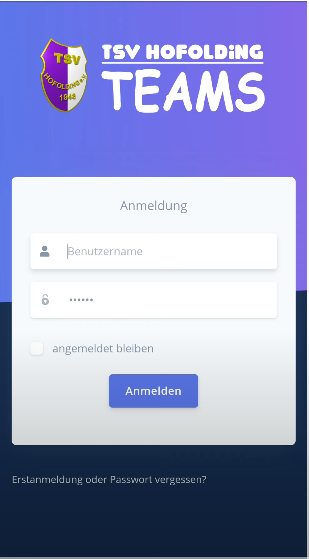
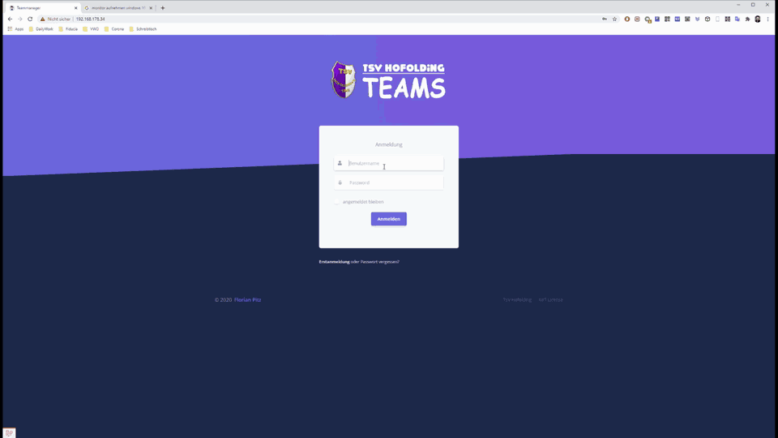
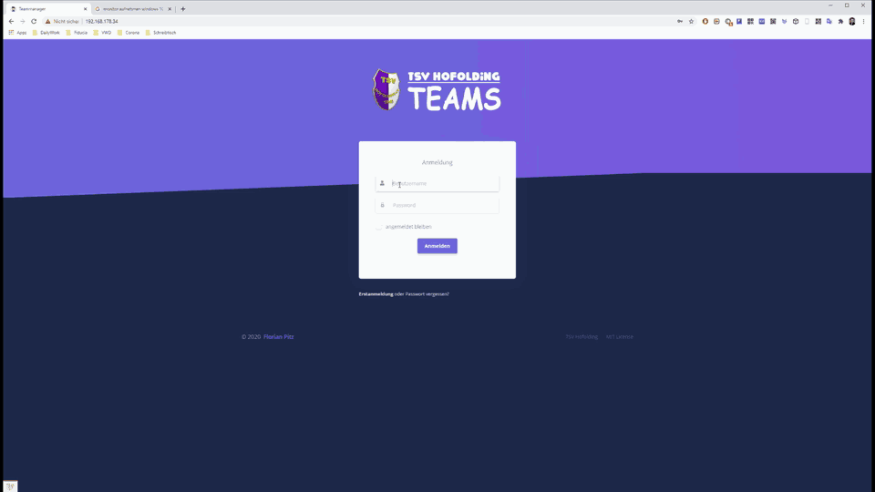

# Teammanager

A Simple, but good team manager to organize events of sports clubs

*Current version*: Teammanager v1.0.x 

## Functions
**Small manual for team members about the main functionality in german language as a [YouTube-Video](https://youtu.be/-BD453LMaU0)**

[](https://youtu.be/-BD453LMaU0)

### Internal team members
**Internal team members can use the following functions:**
- Dashboard
- Change my profile
- Upload profile picture
- **The main function: Confirmation / cancellation of events with <ins>waitlist</ins>**



### External team members
**External team members can use the same function as internal ones, but**
- Confirmation / cancellation of events <ins>*only on the last day of the registration period*</ins>

### Organizer
**Organizers have all functions of the internal team member and additionally:**
- Create / edit / assign team members
- Create / edit groups
- Create / edit events



### Superadmin
**Superadmins have all functions of the organizer and additionally**
- Settings (currently still without function)

### Language
Currently only German is fully supported. Many things are also in English, but at the moment by far not all.

## Prerequisites
To use team managers at the moment, you need a little programming experience. Basic knowledge of git, Docker, PHP (maybe Laravel-Framework) and HTML is necessary to customize it to your needs.

## Installation
**The installation instructions are still under construction!**

There are several ways to install Teammanager. The fastest way is probably to use the customized Laradockimage.

### Install [Laradock for Teammanager](https://github.com/docpitz/laradock_teammanager)
In the directory structure it should look like this afterwards:
* *C:\projects\tm\ (for example)*
    * data *(generated)*
    * laradock
    * teammanager
    
### Install teammanager
* The file .env.example must be copied to .env and then adjusted accordingly. 
* Database with the name teammanager must be created in phpmyadmin.

* Then enter the following command in the console:
```shell script
docker exec -it laradock_workspace_1 /bin/bash
php artisan migrate
```
* Open the corresponding website in your browser and log in with admin / secret

Have fun with team manager and good organization ;-)

## Author
- Florian Pitz

## License
Teammanager is available under the MIT license. See [the LICENSE file](LICENSE) for more information.


